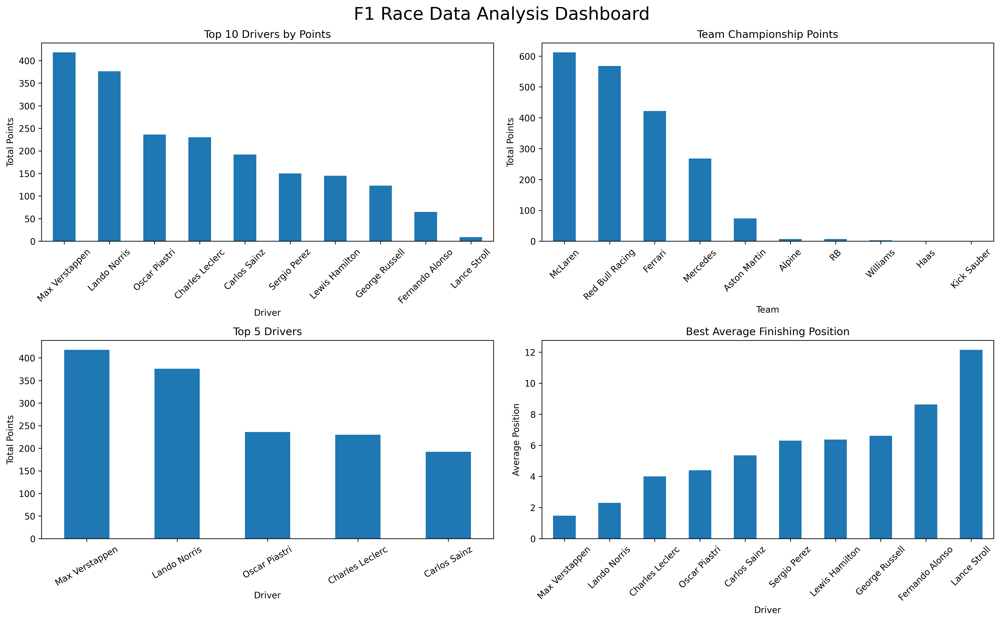

# F1 Race Data Analysis Dashboard

## About the Project

This project is about analyzing Formula 1 race data using Python.

I used Pandas for data cleaning and analysis, Excel for the dataset, and Matplotlib for creating graphs.

The project compares driver and team performance using race points, finishing positions and fastest laps.

## Objective

The main objective of this project is to understand F1 race data and find useful information about driver and team performance.

## Tools Used

- Python
- Pandas
- Matplotlib
- Excel
- VS Code

## Dataset

The dataset contains 400 race records with the following columns:

- Driver
- Team
- Race
- Position
- Points
- Fastest Lap

## Analysis Done

In this project, I performed the following analysis:

- Driver championship points
- Team championship points
- Top 5 drivers
- Driver performance by team
- Race-wise points
- Fastest lap analysis
- Average finishing position
- Data cleaning and validation

## Visualizations


The project contains graphs for:

- Driver championship points
- Team performance
- Top 5 drivers
- Race-wise points
- Fastest laps
- F1 performance dashboard

## Key Insights

The project gives information about:

- Driver with the highest total points
- Team with the highest total points
- Driver with the most fastest laps
- Best average finishing position
- Total number of races, drivers and teams

## How to Run the Project

### 1. Install Python

Make sure Python is installed on your computer.

### 2. Install Required Libraries

Open Terminal and run:

```bash
python3 -m pip install pandas matplotlib openpyxl
